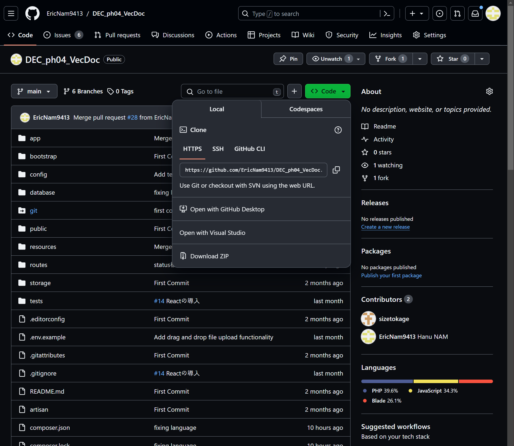

# データエンジニアカタパルト Phase04 チーム VecDoc の制作物

## 使用技術
- Laravel sail + docker
- React
- Azure Blob Storage
- My SQL

## 環境構築

codespaceの場合 


  


[create codespace on main]をクリックで終了


Localの場合 


上から順番に叩く。

```
git clone git@github.com:EricNam9413/DEC_ph04_VecDoc.git

cd DEC_ph04_VecDoc

mkdir -p storage/framework/cache/data/
mkdir -p storage/framework/app/cache
mkdir -p storage/framework/sessions
mkdir -p storage/framework/views

docker run --rm \
    -u "$(id -u):$(id -g)" \
    -v $(pwd):/var/www/html \
    -w /var/www/html \
    laravelsail/php81-composer:latest \
    composer install --ignore-platform-reqs

cp .env.example .env

./vendor/bin/sail up -d

./vendor/bin/sail php artisan key:generate


./vendor/bin/sail composer require laravel/breeze --dev
./vendor/bin/sail php artisan breeze:install

./vendor/bin/sail php artisan migrate:fresh
./vendor/bin/sail php artisan db:seed

```
breezeについてはReactのssrを選択してください。

また、Seederファイルやmigrationファイルが編集されたものをpullしたときは
```
./vendor/bin/sail php artisan migrate:fresh
./vendor/bin/sail php artisan db:seed
```

Breezeのインストールの際に既存のルーティングが消えてしまいます。([参考](https://biz.addisteria.com/breeze_routes_disappear/))

現段階では、VScodeの機能などを用いて手動で戻してください。

Reactについては
```
./vendor/bin/sail npm install
./vendor/bin/sail npm run dev
```
を実行する。
上で./vendor/bin/sail php artisan key:generateまで行い先の2行を実行してもよい。


## 制作物説明概要

- 私たちのチームは、オルターブース社のように複雑で多様な社内規範と規約を持つ企業が直面する課題に対応するため、バージョン管理機能を備えた公開システムを開発しました。

## 解決したい課題

-オルターブース社は内部統制を実施する過程で、複雑で多様な社内規範と規約を持っています。これらの規範や規約が多いため、従業員が必要な情報を効果的に探すのが難しい問題が発生しています。

（問題例：育児休業に関する規定で許可されている休暇日数を探すなど、具体的な情報へのアクセスが難しい。）

-膨大な量のデータを安全かつ効率的に保存・管理する必要がある

-文書が継続的に更新される中で、以前のバージョンとの一貫性を保つことが不可欠

-大量の文書の中から必要な文書を迅速かつ正確に見つける方法か必要（例：github）


## 解決策

-このシステムはアジュールクラウドサービスとの連携により大容量ファイルの保存を容易にし、権限分割により管理者と非管理者間でのファイルアクセスを可能にします。

-文書ごとにカテゴリーを分け、より使いやすい文書アクセスを提供します。


## 実装予定の機能・画面

-今後は、RAGを利用した-ベクター検索やデプロイメントを通じてシステムをさらに進化させる計画です。

このシステムは複雑な社内規範を持つ多くの企業に役立つと考えています。